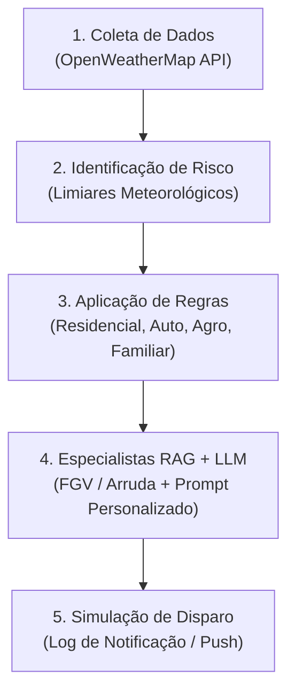

<h1 align="center">Sistema RAG Multiagente Hierárquico com LangGraph, FAISS e Harness de Governança</h1>

Sistema de monitoramento meteorológico e geração automática de comunicações preventivas para segurados, utilizando **agentes inteligentes**, **APIs climáticas públicas** (OpenWeatherMap) e **IA generativa** em arquitetura multiagente com **LangGraph**.

O objetivo é transformar a relação reativa entre seguradoras e clientes em uma abordagem **preventiva**, identificando situações de risco meteorológico antes que sinistros ocorram.

<h3 align="center">Entregável do Desafio 05 — InsurMinds: Inteligência Artificial aplicada a Seguros</h3>

<p align="center"><strong>Weather Insurance</strong> — Prevenção climática via agentes, APIs e IA generativa.</p>

---

## 📌 Visão Geral e Contexto

No setor securitário tradicional, a imensa maioria das interações entre a seguradora e o segurado ocorre de maneira **reativa** — ou seja, apenas após a ocorrência e aviso do sinistro.
O **Weather Insurance AI** transforma esse paradigma através de uma **abordagem preditiva e preventiva**. O sistema monitora continuamente variáveis meteorológicas em tempo real e previsões futuras, correlaciona anomalias climáticas com as apólices dos segurados (Residencial, Automotivo, Agro, Familiar) e gera comunicações personalizadas e empáticas antes que o dano se concretize.

---

## 🎯 Objetivos do Projeto

- **Monitoramento Meteorológico:** Integração com a API pública do **OpenWeatherMap** (clima atual e previsão estendida).
- **Detecção de Eventos Críticos:** Identificação automatizada de chuvas torrenciais, tempestades severas, vendavais, granizo e variações térmicas anômalas.
- **Motor de Regras de Negócio:** Cruzamento geográfico e paramétrico entre eventos climáticos e tipos de cobertura contratadas.
- **RAG com Agentes Especialistas:** Consulta a literatura técnica e de políticas públicas sobre desastres e regulação climática (**FGV** e **Arruda**).
- **Geração de Comunicação Proativa:** Redação de mensagens claras, humanizadas e práticas orientando medidas imediatas de mitigação de danos.
- **Simulação de Disparo:** Rastreamento do ciclo completo de envio multicanal (WhatsApp, SMS, Push, E-mail).

---

## 🔄 Fluxo de Execução do Sistema (5 Etapas)



1. **Coleta Meteorológica (`fetch_weather`):** Requisições com retentativa exponencial aos endpoints de tempo real e previsão da OpenWeatherMap.

2. **Detecção de Riscos (`detect_risks`):** Avaliação contra limiares de severidade (RULES_ENGINE_CONFIG), classificando o risco em Baixo, Médio, Alto ou Crítico.

3. **Casamento de Apólices (`match_policy_rules`):** Seleção das diretrizes securitárias conforme o perfil do segurado (ex.: proteção contra granizo para automóveis; desobstrução de calhas para residências; proteção de maquinário para agronegócio).

4. **Consulta Especializada e Redação (`consult_specialist` e `generate_notification`):** O Supervisor aciona o especialista via RAG (FAISS + Cohere) e o LLM sintetiza a mensagem com tom humanizado.

5. **Disparo Simulado (`dispatch_simulation`):** Geração de log estruturado contendo timestamp, canal, destinatário e confirmação de entrega.

---

## 🏗️ Arquitetura e Especialistas da Base de Conhecimento

O sistema utiliza indexação vetorial com FAISS e Cohere Embeddings v3 (`embed-multilingual-v3.0`), cobrindo bases documentais em `docs/weather/`:

| Especialista | Documento Fonte | Escopo de Conhecimento |
| --- | --- | --- |
| FGV | `FGV_Seguro_Mudancas_Climaticas.pdf` | Agenda de políticas públicas, modelos internacionais de benchmark, regulação e micro/pequenas empresas. |
| Arruda | `ARRUDA_Seguro_Catastrofes_Climaticas.pdf` | Direito dos desastres, adaptação securitária a catástrofes climáticas e mitigação de perdas no Brasil. |

---

## 🗂️ Estrutura do Projeto

```
root/
├── agents/
│   ├── specialist/
│   │   ├── __init__.py
│   │   ├── llm_manager.py                # Gerenciador resilitente de LLMs
│   │   └── base.py                       # Classe base dos agentes especialistas
│   └── supervisor/
│       ├── __init__.py
│       ├── agent.py                      # Agente Supervisor (roteador)
│       ├── models.py                     # Estruturas Pydantic (AgentSelection)
│       └── specialist_summaries.json     # Metadados e escopos para cada especialista
├── core/
│   ├── __init__.py
│   ├── protocols.py                      # Protocolo de Comunicação de Agentes (ACPMessage)
│   ├── state.py                          # Estrutura do estado global (AgentState)
│   └── harness/
│       ├── context_pipeline.py           # Trunca histórico de mensagens
│       ├── execution_boundary.py         # Verifica roteamento
│       └── verification.py               # Revalida sinais de confiança
├── weather_api_clients/
│   └── openweather_client.py             # Cliente OpenWeatherMap
├── docs/
│   └── weather/                          # Documentos PDF de base de conhecimento
│       ├── FGV_Seguro_Mudancas_Climaticas.pdf
│       └── ARRUDA_Seguro_Catastrofes_Climaticas.pdf
├── faiss_index/                          # Índices FAISS gerados automaticamente
├── app.py                                # Interface gráfica em Streamlit (Entry Point)
├── config.py                             # Configurações globais, paths e modelos
├── indexing.py                           # Criação e carregamento dos índices FAISS
├── rag_multiagent.py                     # Definição do grafo de fluxo LangGraph
├── requirements.txt                      # Dependências do projeto
├── .env                                  # Chaves de API e configurações de ambiente
├── .env.example                          # Exemplo do conteúdo de .env
└── .gitignore                            # Arquivos ignorados pelo controle de versão
```

> O índice FAISS (`faiss_index/`) é gerado localmente e ignorado pelo `.gitignore`.

---

## 🛡️ Camadas do Harness de Governança
O projeto implementa 3 camadas de governança arquitetural que interceptam e validam o fluxo dos agentes:

1. **Camada 2 - Context Pipeline (`TokenBudgeter`)**:
   - Orçamentação de tokens para truncamento determinístico de histórico (`messages`), preservando o histórico completo no estado do LangGraph enquanto injeta apenas o contexto orçado nos prompts.
2. **Camada 3 - Execution Boundary (`RoutingEnforcer`)**:
   - Valida nomes de especialistas retornados pelo LLM contra o catálogo oficial `SPECIALIST_DOCUMENTS`. Corrige variações de formatação e faz fallback seguro para `"geral"`.
3. **Camada 5 - Verification Loop (`StrictConfidenceVerifier`)**:
   - **Anti-Overconfidence**: Corrige falsos positivos onde o LLM se declara confiante mas usa expressões de incerteza ("não encontrei", "consulte o manual").
   - **Groundedness Check**: Detecta alucinações em respostas institucionais do Supervisor comparando e-mails, telefones e CNPJs contra o `specialist_summaries.json`.

---

## ⚙️ Pré-requisitos e Configuração

1. **Requisitos**

* Python 3.11 ou superior
* Chave de API da [OpenWeatherMap](https://openweathermap.org/api)
* Chave de API da [Cohere](https://docs.cohere.com/reference/about) (para embeddings vetoriais)
* Chave de API de LLM: [Groq](https://console.groq.com/keys), [Google Gemini](https://ai.google.dev/gemini-api/docs/api-key?hl=pt-br) ou [OpenRouter](https://openrouter.ai/docs/api_reference/authentication)

2. **Configuração do Ambiente**
Crie o arquivo `.env` a partir do `.env.example`.

--- 

## 🚀 Instalação e Uso

```bash
# 1. Clone o repositório
git clone <url-do-repositorio>
cd RAG

# 2. Crie e ative o ambiente virtual
python -m venv .venv
.venv\Scripts\activate      # Windows
# source .venv/bin/activate  # Linux/macOS

# 3. Instale as dependências
pip install -r requirements.txt

# 4. Configure as variáveis de ambiente
# Copie o arquivo .env.example e preencha com suas chaves em .env
cp .env.example .env

# 5. Coloque seus PDFs na pasta docs/
# (a estrutura de subpastas é carregada automaticamente pelo DirectoryLoader)
```

> ⚠️ **Nunca comite o arquivo `.env`!** Ele já está listado no `.gitignore`.

---

## 📊 Demonstração na Interface (Streamlit)

A aplicação gráfica permite:

1. **Seleção de Perfil de Segurado:** Simulação com múltiplos perfis pré-configurados (`MOCK_CLIENTS`) em diversas regiões do Brasil (Porto Alegre, Goiânia, São Paulo, Belém, Jaraguá do Sul).
2. **Painel Climático em Tempo Real:** Visualização de temperatura, velocidade do vento, volume de chuva e condição do tempo.
3. **Diagnóstico de Risco e Regras:** Exibição da severidade calculada e regras de apólice ativadas.
4. **Mensagem Preventiva Personalizada:** Leitura da mensagem gerada pela IA generativa pronta para envio ao segurado.
5. **Log de Telemetria e Disparo:** Rastreabilidade do status de envio simulado.

---

## 📝 Licença

Projeto de estudo — com licença MIT. Uso livre para fins educacionais.