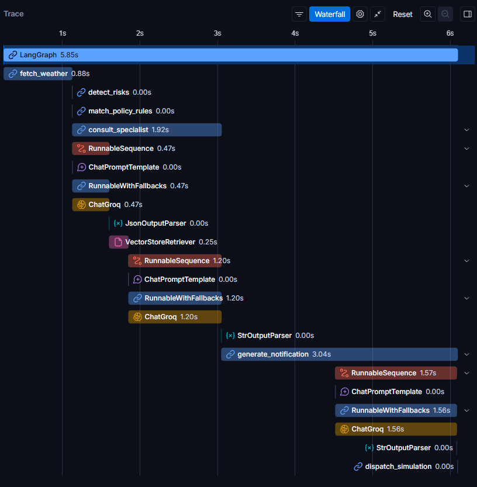

# Relatório Técnico: Weather Insurance AI - Sistema de Prevenção Climática

Sistema de monitoramento meteorológico e geração automática de comunicações preventivas para segurados, utilizando **agentes inteligentes**, **APIs climáticas públicas** (OpenWeatherMap) e **IA generativa** em arquitetura multiagente com **LangGraph**.

O objetivo é transformar a relação reativa entre seguradoras e clientes em uma abordagem **preventiva**, identificando situações de risco meteorológico antes que sinistros ocorram.

## Entregável do Desafio 05 — InsurMinds: Inteligência Artificial aplicada a Seguros

Repositório GitHub público: 

[https://github.com/RAguiarEng/weather_insurance](https://github.com/RAguiarEng/weather_insurance)

**Equipe:**

| Nome	| E-mail |
| --- | --- |
| Bruno Corrêa	| correabruno321@gmail.com |
| [Jhiovana Silva Ribeiro](https://github.com/jhsribeiro)	| jhiovanasilva11@gmail.com |
| Luis R G Pereira	| luisrgpereira@gmail.com |
| [Rodrigo Medeiros Costa](https://github.com/rodrigomdc)	| eng.rodrigomdc@gmail.com |
| [Rodrigo Souza Aguiar](https://github.com/RAguiarEng)	| rodrigo_souza_aguiar@hotmail.com |

---

## 1. Arquitetura da Solução

O sistema **Weather Insurance AI** é construído sobre uma arquitetura multiagente hierárquica, orquestrada pelo **LangGraph**, que visa transformar a abordagem reativa do setor de seguros em um modelo proativo e preventivo. A solução integra APIs de dados meteorológicos, um motor de regras de negócio determinístico, Retrieval Augmented Generation (RAG) com especialistas de domínio e IA generativa para comunicação personalizada.

A arquitetura é composta por:

*   **Interface de Usuário (Streamlit):** Um dashboard interativo que permite a seleção de segurados, visualização de dados climáticos em tempo real, mapas interativos com camadas meteorológicas, e o acompanhamento do fluxo de processamento e telemetria. Inclui um alerta proativo global na carga da página, identificando o segurado com maior risco.
*   **Agentes Inteligentes (LangGraph):** O coração da lógica de negócios, onde diferentes agentes colaboram para executar o pipeline de 5 etapas, desde a coleta de dados até a geração da notificação.
*   **Harness de Governança:** Três camadas de validação e controle (Context Pipeline, Execution Boundary, Verification Loop) que garantem a confiabilidade, a segurança e a coerência das interações dos LLMs, mitigando alucinações e comportamentos indesejados.
*   **Base de Conhecimento (RAG):** Documentos PDF de especialistas (FGV, Arruda) indexados via FAISS e Cohere Embeddings, permitindo que os agentes consultem informações relevantes para contextualizar as mensagens.
*   **Clientes de API:** Módulos dedicados para interação com APIs externas, como a OpenWeatherMap para dados meteorológicos.

--- 

## 2. Descrição dos Agentes Desenvolvidos

O sistema emprega uma estrutura de agentes com um **Agente Supervisor** que roteia as tarefas para **Agentes Especialistas** conforme a necessidade.

### Agente Supervisor
*   **Função:** Atua como o orquestrador central do fluxo de trabalho. Ele recebe o estado inicial do sistema (dados do segurado, coordenadas, tipo de apólice) e coordena a execução das etapas.
*   **Roteamento:** Decide qual Agente Especialista (ou qual etapa do pipeline) deve ser acionado em cada momento, com base na lógica de negócio e na necessidade de consulta.
*   **Governança:** Aplica as camadas de governança para garantir que as decisões e as informações fluam de maneira controlada e confiável.

### Agentes Especialistas (FGV, Arruda)
*   **Função:** Cada especialista é responsável por um domínio específico de conhecimento, acessando sua própria base documental via RAG.
*   **Bases de Conhecimento:**
    *   **FGV:** Especializado em políticas públicas, modelos internacionais de benchmark, regulação e micro/pequenas empresas no contexto de seguros e mudanças climáticas.
    *   **Arruda:** Focado em direito dos desastres, adaptação securitária a catástrofes climáticas e estratégias de mitigação de perdas no Brasil.
*   **Geração de Conteúdo:** Fornecem informações e diretrizes que são utilizadas pelo Supervisor e pelos LLMs para contextualizar e enriquecer as mensagens preventivas.

--- 

## 3. Tecnologias Utilizadas

A solução utiliza uma stack tecnológica moderna e robusta, focada em IA generativa, orquestração de agentes e escalabilidade:

*   **Python 3.11+:** Linguagem de programação principal.
*   **LangGraph:** Framework para construção de aplicações multiagente com LLMs, permitindo grafos de execução cíclicos e com estado.
*   **LangChain:** Biblioteca base para componentes de LLM, como modelos de linguagem, prompts e cadeias de processamento.
*   **Streamlit:** Framework para a construção da interface de usuário interativa e de demonstração.
*   **Folium / Leaflet:** Biblioteca Python para visualização de mapas interativos, permitindo a integração de dados geográficos e camadas meteorológicas.
*   **FAISS:** Biblioteca para busca de similaridade eficiente em grandes volumes de dados vetoriais, utilizada para o Retrieval Augmented Generation (RAG).
*   **Cohere Embeddings (embed-multilingual-v3.0):** Modelo de embeddings para transformar texto em vetores numéricos, essencial para a busca vetorial no FAISS.
*   **LLMs (Groq, Google Gemini, OpenRouter):** Utilização de múltiplos modelos de linguagem grandes, com um gerenciador de LLMs que oferece resiliência (fallback) e otimização de custos.
*   **OpenWeatherMap API:** Fonte de dados meteorológicos em tempo real e de previsão.
*   **Loguru:** Biblioteca para logging estruturado e eficiente.
*   **Tenacity:** Biblioteca para retentativas robustas em chamadas de API e operações suscetíveis a falhas temporárias.
*   **Pydantic:** Para validação de dados e definição de modelos de dados.
*   **python-dotenv:** Para gerenciamento seguro de variáveis de ambiente.
*   **httpx:** Cliente HTTP assíncrono para requisições web.

### Rastreamento LangSmith

Demonstração do rastreamento registrado no LangSmith, na seguinte configuração:

- Segurado: Rodrigo Aguiar

- Tipo de apólice: Agro

- Fonte de dados: App Real (OpenWeatherMap)

---

## 4. Fluxo de Processamento

O sistema opera através de um pipeline de 5 etapas sequenciais, orquestrado pelo LangGraph:

1.  **Coleta de Dados Meteorológicos:**
    *   O sistema inicia buscando dados meteorológicos atuais e de previsão para a localização do segurado via **OpenWeatherMap API**.
    *   Utiliza `httpx` e `tenacity` para garantir a robustez das requisições.
2.  **Identificação de Risco:**
    *   Os dados meteorológicos coletados são avaliados contra um **Motor de Regras de Negócio** (`RULES_ENGINE_CONFIG`).
    *   São verificados limiares de chuva (mm/h), velocidade do vento (km/h), temperatura (°C) e condições climáticas críticas (ex: "Thunderstorm", "Squall").
    *   O risco é classificado em "Baixo", "Médio", "Alto" ou "Crítico".
3.  **Aplicação de Regras de Apólice:**
    *   Com base no tipo de apólice do segurado (Automotivo, Residencial, Agro, Familiar) e no risco identificado, o sistema aplica regras de negócio específicas.
    *   Isso determina as diretrizes securitárias e as recomendações preventivas mais relevantes para o contexto.
4.  **Consulta a Especialistas RAG e Geração de Notificação:**
    *   O **Agente Supervisor** roteia a consulta para o **Agente Especialista** mais adequado (FGV ou Arruda) com base no contexto do risco e da apólice.
    *   O especialista utiliza **RAG (FAISS + Cohere Embeddings)** para recuperar informações relevantes de sua base de conhecimento.
    *   Um **LLM** (Groq, Gemini ou OpenRouter) sintetiza essas informações em uma mensagem preventiva personalizada, empática e acionável para o segurado.
    *   As camadas de governança (Context Pipeline, Execution Boundary, Verification Loop) atuam aqui para garantir a qualidade e a confiabilidade da resposta do LLM.
5.  **Simulação de Disparo de Notificação:**
    *   A mensagem gerada é apresentada em um mockup de smartphone na interface.
    *   Um log de telemetria estruturado é gerado, simulando o registro do envio da notificação, incluindo status, canal (WhatsApp/Push), destinatário e timestamp.

## 5. Exemplos de Mensagens Geradas

As mensagens são dinamicamente geradas pelos LLMs, adaptando-se ao contexto do segurado, tipo de apólice e evento climático. Abaixo, exemplos hipotéticos baseados nos cenários de risco:

### Cenário 1: Tempo nublado com vento, sem risco (Apólice Automotiva)

Olá, Bruno! 🌥️ Hoje em Porto Alegre está nublado, 16 °C, vento de 13 km/h e sem chuva.
- Verifique a pressão dos pneus e o nível de combustível antes de sair.
- Mantenha os faróis acesos e o para-brisa limpo para melhor visibilidade.
- Tenha o kit de emergência (triângulo, lanterna e cabo) à mão.

Em caso de necessidade, nossa assistência 24h está disponível pelo telefone 0800 123 456 ou pelo app. 🚗💨

### Cenário 2: Vendaval e Chuva Torrencial (Apólice Automotivo)

Olá, Bruno! 🌧️ Hoje em Porto Alegre há rajadas de vento intensas (72 km/h) e chuva forte (36,5 mm/h).

- Estacione o carro em local coberto e elevado.

- Evite vias com histórico de alagamento e não tente atravessar áreas inundadas.

Em caso de emergência, nossa Assistência 24 h está disponível pelo 0800 555 1234. 🚗💨

### Cenário 3: Tempestade severa com granizo (Apólice Agro)

Olá Rodrigo, alerta de tempestade com granizo e chuva torrencial em Jaraguá do Sul (18,5 °C, vento 68,4 km/h, 42 mm/h).

- Guarde os maquinários em galpões fechados.

- Verifique sistemas de drenagem e contenção de encostas.

- Leve os animais para abrigos protegidos.

Assistência 24 h: 0800‑123‑4567.

### Cenário 4: Condição Estável, Sem Risco (Apólice Familiar)

Olá Rodrigo, tudo bem? Em Belém o céu está limpo, temperatura estável de 24 °C e vento de 12 km/h.

- Verifique portas e janelas, garantindo que estejam bem fechadas.

- Teste os detectores de fumaça e mantenha o extintor em dia.

- Tenha um kit básico de emergência (lanterna, pilhas, primeiros socorros) à mão.

Qualquer necessidade, nossa assistência 24 h está disponível pelo WhatsApp 0800‑123‑456.

---